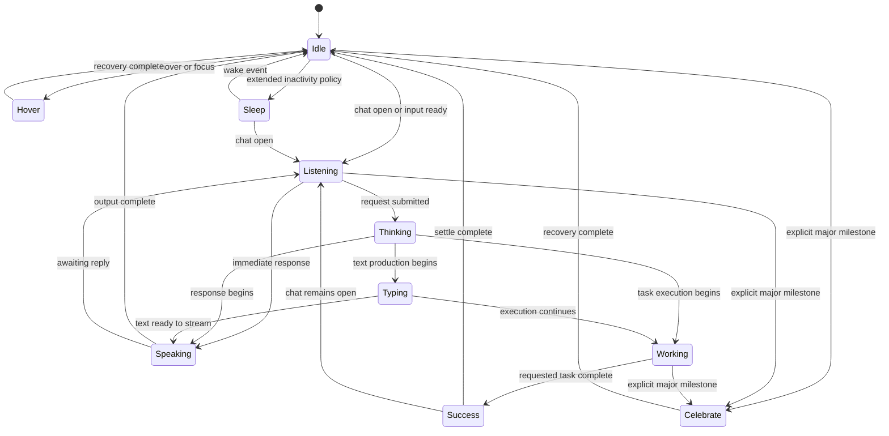

# DON State Machine

Version: `1.0.0`

Visual dependency: DON v1.2

## 1. State model

DON is a finite state machine with exactly one active semantic state.



Blink, slow blink, directional glances, and idle breathing are micro-actions. They do not appear in the semantic graph and never replace `currentState`.

## 2. State record

The engine owns one record:

```text
currentState
previousState
variant
enteredAt
transitionToken
lockedUntil
hoverCooldownUntil
hoverExitObserved
visible
documentActive
reducedMotion
queuedRequest
```

Product code may request a semantic state. It may not set frame indexes, offsets, props, or eye frames.

## 3. Priority

Priority resolves simultaneous requests. It does not authorize unsafe interruption.

| Priority | State/request | Rule |
|---:|---|---|
| 100 | Lifecycle stop, hidden, destroyed | Cancel to a still frame immediately |
| 90 | Celebrate | Explicit major milestone only |
| 80 | Success | Confirmed requested completion |
| 70 | Hover | Eligible only when no semantic work is active |
| 60 | Typing / Working | Active execution owns the body |
| 50 | Speaking | Active output owns the face cadence |
| 40 | Thinking | Processing before execution |
| 30 | Listening | Active input readiness |
| 20 | Sleep | Inactivity policy only |
| 10 | Idle | Default stable state |
| 0 | Micro-action | Never preempts a body state |

If a high-priority request arrives during a locked one-shot, it is stored as one coalesced `queuedRequest`. Only the newest request of the highest priority is retained.

## 4. State permissions

| State | Loops | Body lock | Laptop | Blink | Eye glance | Exit policy |
|---|---|---|---|---|---|---|
| Idle | No mechanical loop | No | No | Yes | Yes | Immediate at still frame |
| Hover | One shot | Yes | No | No | No | After recovery |
| Thinking | Hold after entry | Soft | Optional | During hold | One micro-glance | Authored exit |
| Typing | Cycles with pauses | Pair lock | Yes | Pause only | No | End hand pair or pause |
| Listening | Hold after entry | Soft | No | After entry | No | Authored exit |
| Speaking | Cadence with long holds | Soft | No | Alternate with cadence | Cadence only | End cadence or still hold |
| Sleep | Slow randomized cycle | Soft | No | Closed eyes | No | Wake transition |
| Celebrate | One shot | Yes | No | No | No | After recovery |
| Success | One shot | Yes | No | No | No | After settle |
| Working | Slow cycle with holds | Soft | Yes | Hold only | Focus frames only | Authored exit |

## 5. Transition graph rules

### Direct transitions

The following transitions have dedicated authored bridges:

- Idle ↔ Listening
- Listening → Thinking
- Thinking → Typing
- Thinking → Working
- Thinking → Speaking
- Typing → Speaking
- Typing → Working
- Working → Success
- Speaking → Idle
- Speaking → Listening
- Success → Idle
- Success → Listening
- Idle ↔ Sleep
- safe state → Celebrate
- Celebrate → Idle

### Routed transitions

Unsupported direct requests route through a stable frame:

- Hover request from any non-Idle state is ignored.
- Sleep request during semantic work is deferred until the work state returns to Idle.
- Typing request from Idle routes through Thinking unless the product already has confirmed text production.
- Working request from Listening routes through Thinking.
- Celebrate never routes automatically from Success.

### Safe transition point

A safe transition point is:

- a still hold;
- the end of a typing hand pair;
- the end of a speaking cadence;
- the recovery frame of a one-shot;
- an explicitly authored exit frame.

## 6. Hover lock

Hover uses three independent conditions:

1. `hoverLocked` while the sequence is playing;
2. `hoverCooldownUntil = completion + 6000 ms`;
3. `hoverExitObserved` must become true after pointer or focus leaves.

The next Hover is eligible only when:

```text
currentState == Idle
AND hoverLocked == false
AND now >= hoverCooldownUntil
AND hoverExitObserved == true
AND visible == true
AND documentActive == true
AND reducedMotion == false
```

Repeated `pointerenter`, `mouseenter`, focus, or synthetic hover events are coalesced. The sequence never restarts from its current frame.

## 7. Micro-action scheduler

The scheduler runs only while a host state permits it.

### Idle eligibility

```text
visible
AND documentActive
AND currentState == Idle
AND no transition
AND no queued semantic request
AND reducedMotion == false
AND user is not actively typing, dragging, or scrolling
```

### Selection

After an Idle micro-action, sample a new quiet window. Do not run a second action immediately.

Suggested weighted selection after the quiet window:

| Micro-action | Weight |
|---|---:|
| Remain still and reschedule | 45% |
| Blink | 30% |
| Idle breath | 15% |
| Directional glance | 8% |
| Slow blink | 2% |

Weights are not guarantees. Product analytics may reduce automatic movement but may not increase it above this profile without motion review.

## 8. Event handling

| Event | Request | Guard |
|---|---|---|
| `page:load` | Idle | Still frame first; no animation before visibility |
| `idle:5s` | Idle micro-action eligibility | One scheduler decision only |
| `don:hover-enter` | Hover | Hover lock conditions |
| `don:hover-exit` | mark exit observed | Does not interrupt active Hover |
| `chat:open` | Listening | Always wakes Sleep |
| `chat:close` | Idle | Queue if one-shot is locked |
| `request:submitted` | Thinking | Requires a real user request |
| `generation:typing` | Typing | Laptop asset ready |
| `task:working` | Working | Real task execution active |
| `output:streaming` | Speaking | Real output active |
| `task:complete` | Success | Confirmed completion only |
| `milestone:major` | Celebrate | Explicit product classification |
| `page:change` | Idle still frame | Cancel decorative micro-actions |
| `import:complete-visible` | Success | User-initiated visible import |
| `hq:notification` | directional glance | Idle, visible, rate limit 15 seconds |
| `visibility:hidden` | pause | Immediate still frame |
| `motion:reduced` | reduced profile | Immediate safe still frame |

## 9. Cancellation

Every sequence is associated with a transition token. A lifecycle cancellation invalidates the token, clears timers, and draws the current state's reduced-motion still frame.

Cancellation must not:

- leave the laptop visible in a non-laptop state;
- leave eyes between approved expressions;
- leave DON above the ground line;
- leave a body part outside the v1.2 envelope;
- announce success that did not occur.

## 10. Test matrix

The state machine is not approved until automated tests confirm:

- every allowed transition reaches a stable state;
- every unsupported transition is routed or ignored predictably;
- Hover always has exactly three apexes;
- Hover never stacks or restarts;
- cooldown and exit observation both gate Hover;
- Celebrate and Success run once;
- laptop presence matches state permissions;
- micro-actions never preempt semantic states;
- hidden and offscreen instances pause;
- reduced motion never schedules automatic movement;
- destruction clears every timer and observer;
- queued requests coalesce by priority.
