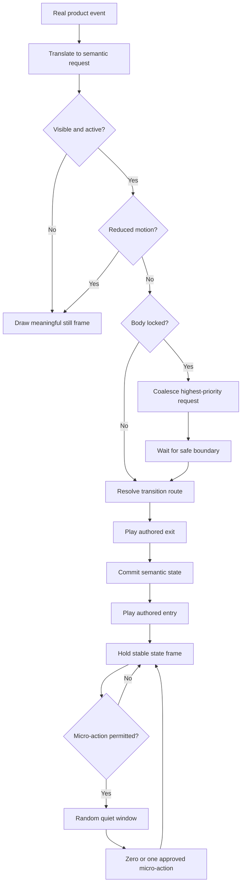
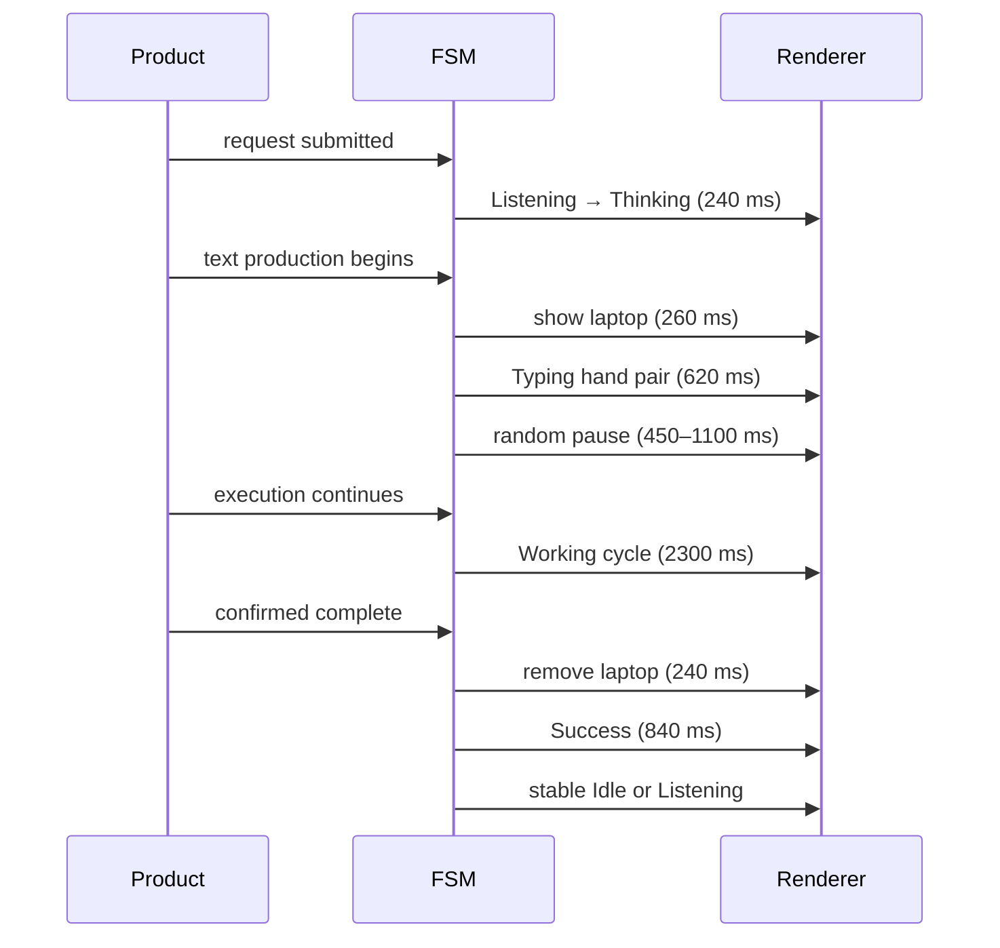

# DON Motion System v1.0 — Animation Flow

## Request lifecycle



## Hover flow

```text
stable
  → anticipation
  → jump 1 rise
  → apex -7
  → land 1
  → jump 2 rise
  → apex -6
  → land 2
  → jump 3 rise
  → apex -5
  → final fall
  → final land
  → recovery
  → stable Idle
  → 6000 ms cooldown + required exit/re-entry
```

Total playback: `1185 ms`.

## Work flow



## Cancellation flow

Lifecycle cancellation—hidden document, destroyed instance, navigation replacement, or reduced-motion activation—invalidates the current transition token, clears timers, removes state-only props when needed, and draws the active state's approved still frame.

The engine never fast-forwards through missed frames after a hidden tab resumes.
