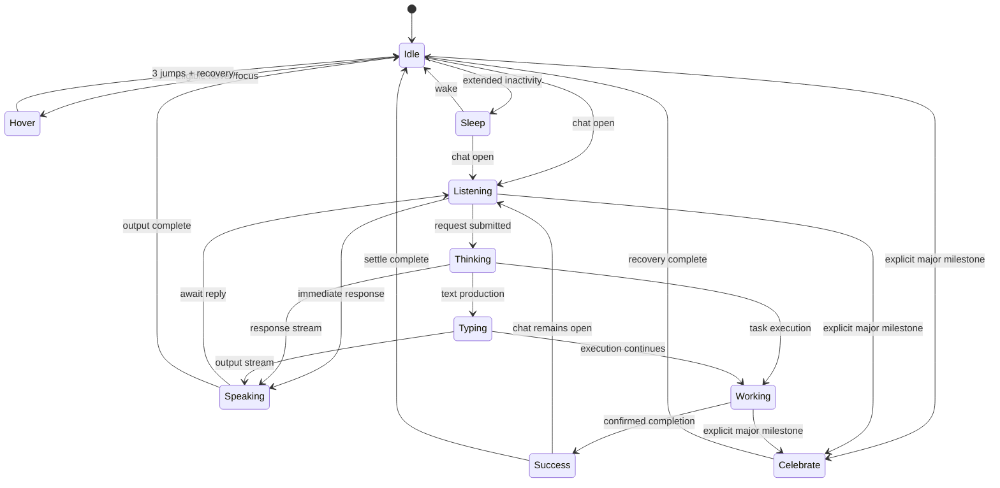
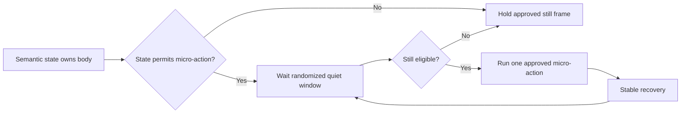

# DON Motion System v1.0 — State Diagram

Visual dependency: DON v1.2, locked



## Overlay model

Blink, slow blink, directional glances, idle breath, and Wave are not semantic states.



The body-level action lock prevents Wave or any micro-action from layering over Hover, Celebrate, Success, Typing hand motion, or a state transition.

## State priority

| Priority | Request |
|---:|---|
| 100 | Hidden, destroyed, lifecycle stop |
| 90 | Celebrate |
| 80 | Success |
| 70 | Hover |
| 60 | Typing / Working |
| 50 | Speaking |
| 40 | Thinking |
| 30 | Listening |
| 20 | Sleep |
| 10 | Idle |
| 0 | Blink, glance, breath, Wave |

Priority selects the queued request. Locked one-shots still finish unless lifecycle safety requires immediate cancellation.

## Hover eligibility

```text
Idle
AND visible
AND document active
AND reduced motion disabled
AND body unlocked
AND 6-second cooldown expired
AND pointer/focus exit observed since previous Hover
```

Hover contains exactly three apexes: `-7 px`, `-6 px`, and `-5 px`.
